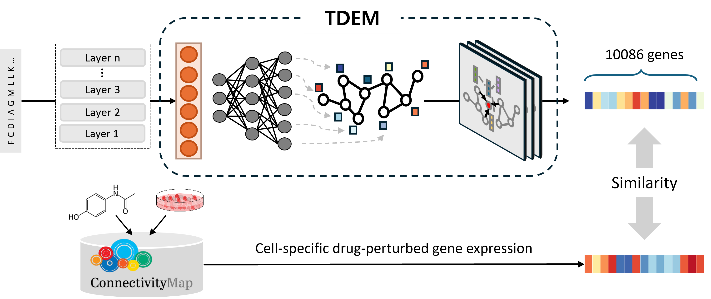

# TDEM
We introduce TDEM (Target-
induced Differential Expression Matrix), a novel computational framework that generates in silico target-perturbed
expression profiles from drug-induced transcriptomic data. TDEM circumvents experimental noise by learning target
representations computationally rather than relying on confounded genetic perturbation data. 



## Table of Contents

- [Installation](#installation)
- [Preprocessing](#preprocessing)
- [Training](#Training)
- [Data](#data)
- [Citation](#citation)


## Installation

1. Clone the repository and download the `TDEM.yaml` environment file.
2. Create the conda environment:
    ```bash
    conda env create -f TDEM.yaml
    ```
3. Activate the environment:
    ```bash
    conda activate TDEM
    ```
    
## Data

All data used for model training, the pretrained models for six cell lines (A375, A549, HT29, HA1E, MCF7, and PC3), and the comprehensive TDEM dataset can be downloaded from the following link: 
[Google Drive](https://drive.google.com/drive/folders/1rnlX_vkhixhHDbbmGSW5WDtSUSMvndHc?usp=drive_link)

## Preprocessing

- **Extract protein sequences from UniProt IDs**
  - Script: `get_uniprot_sequences.py`
  - Usage:
    ```bash
    python get_uniprot_sequences.py \
        --input_seqfile /path/to/uniprot_id.csv \
        --prefix test \
        --output_dir /path/to/output_directory \
        --ncore 40
    ```
  - Input: CSV file with a column named `uniprot_id` or `UniProt`
  - Output: `<prefix>_uniprot2sequence.tsv` in the specified output directory

- **Embed protein sequences using Pre-trained Language Models (PLM)**
  - Script: `embed_sequence_with_PLM.py`
  - Usage:
    ```bash
    python embed_sequence_with_PLM.py \
        --input_seqfile /path/to/uniprot2sequence.tsv \
        --PLM esm2 \
        --prefix test \
        --output_dir /path/to/output_directory \
        --batch_size 8
    ```
  - Input: TSV file of protein sequences (output of previous step)
  - Output: `<prefix>_esm2_embeddings.tsv.gz` in the specified output directory

## Training

- **Train and evaluate the TDEM model**

  - Script: `benchmark_TDEM_with_train_val_test_set.py`
  - Usage:
    ```bash
    python benchmark_TDEM_with_train_val_test_set.py \
        --cell A549 \
        --DTI_dataset_dir ./data/benchmark_DTI_dataset \
        --output_dir ./output/benchmark/TDEM \
        --ablation_mode full \
        --uniprot_embed_method esm2 \
        --device_num 0 \
        --random_seed 42 \
        --max_num_epochs 300 \
        --lr 1e-5 \
        --dropout 0.1 \
        --l2norm 1e-5 \
        --hidden_dims 512 256 512 \
        --graph_node_embed_dim 32 \
        --batch_size 250 \
        --gat_num_heads 3 \
        --early_stopping_patience 5 \
        --gene_space best_inferred
    ```
  - Required arguments:
    - `--cell`: Cell line to use (`A375`, `A549`, `MCF7`, `PC3`, `HT29`, or `HA1E`)
  - Main options:
  - `--DTI_dataset_dir`: Directory containing DTI train/val/test datasets (default: `./data/benchmark_DTI_dataset`). Each file must contain three columns: `CID`, `UniProt`, and `Binding`.  If needed, you may need to update the DTI file names directly in the training script.
    - `--output_dir`: Directory for outputs (default: `./output/benchmark/TDEM`)
    - `--ablation_mode`: Model ablation (`full`, `no_gat`, `no_pretrained`)
    - `--uniprot_embed_method`: Protein embedding method (`esm2`, `protbert`, `gene2vec`)
    - `--device_num`: GPU device index
    - `--random_seed`: Random seed for reproducibility
    - `--max_num_epochs`: Maximum training epochs (default: 300)
    - `--lr`: Learning rate (default: 1e-5)
    - `--dropout`: Dropout rate (default: 0.1)
    - `--l2norm`: L2 regularization strength (default: 1e-5)
    - `--hidden_dims`: Hidden layer sizes (space-separated, e.g., `512 256 512`)
    - `--graph_node_embed_dim`: Node embedding size in GAT module (default: 32)
    - `--batch_size`: Batch size (default: 250)
    - `--gat_num_heads`: Number of GAT attention heads (default: 3)
    - `--early_stopping_patience`: Early stopping patience (default: 5)
    - `--gene_space`: Gene set to use (`best_inferred`, `all`, etc.)

  - Output:
    - Model checkpoints, logs, and performance results will be saved in the specified `output_dir`.

## Generation of TDEM from Pretrained model

After preprocessing and generating protein sequence embeddings (`<prefix>_<PLM>_embeddings.tsv.gz`), you can predict cell line-specific TDEM (Target-Gene Expression Matrix) for novel protein sequences using a pretrained TDEM model.

- **Script:** `get_TDEM_from_novel_sequence_embed.py`
- **Usage:**
    ```bash
    python get_TDEM_from_novel_sequence_embed.py \
        --input_embed_file /path/to/<prefix>_<PLM>_embeddings.tsv.gz \
        --save_dir /path/to/output \
        --prefix test \
        --cell A549 \
        --best_model_path /path/to/best_model.pt \
        --batch_size 1000
    ```

- **Description:**
    - After obtaining embeddings via preprocessing, you can use this script to generate TDEM predictions for any novel protein sequence, specific to each cell line.
    - The resulting TE matrix will be saved as `test_<cell>_TE_matrix.csv` in the specified output directory.


## Citation

[If applicable, add citation information or links to relevant papers.]
